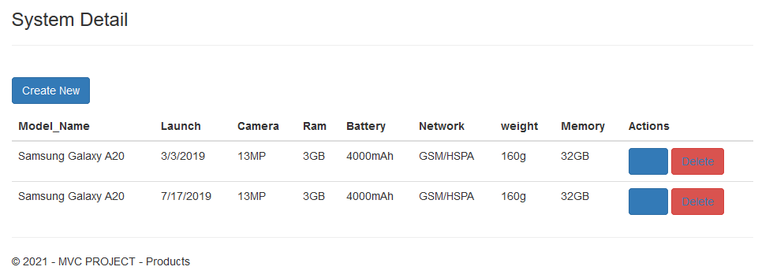
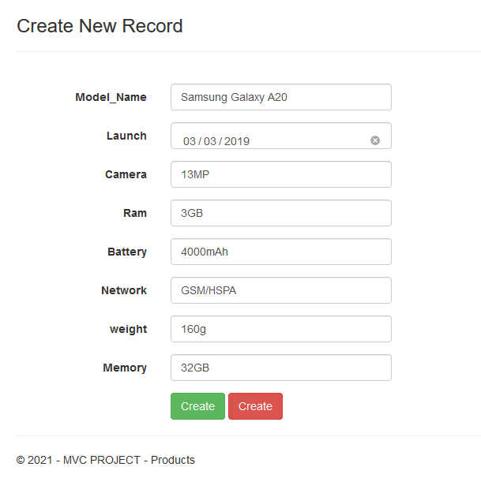
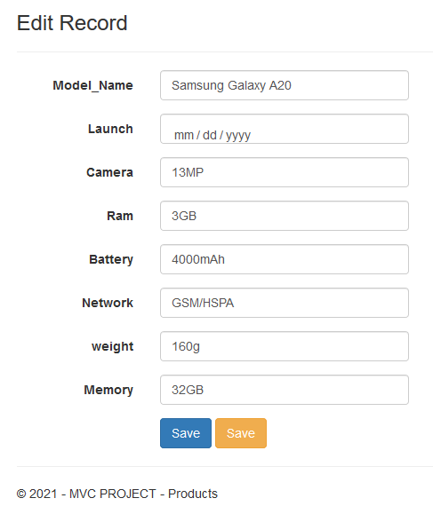
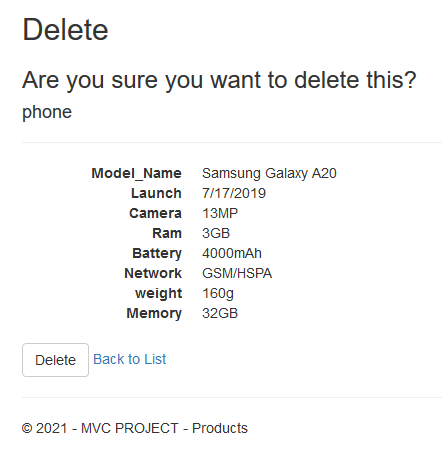

<h1 align="center">
    <strong>MVC Web Application</strong>
</h1>
<h3 align="center">
    
ASP.NET MVC CRUD Web Application

</h3>

## List of items:

## Create item:

## Edit item:

## Delete item:

## Delete item

## Database
DB Name:  'Mobile'\
Table Name: 'phone'\
Columns:

| Name | Data Type | Allow Nulls |
|-|-|-|
| Model_Name | nvarchar(50) | null |
| Launch | date | null |
| Camera | navchar(50) | null |
| Ram | navchar(50) | null |
| Battery | navchar(50) | null |
| Network | navchar(50) | null |
| weight | navchar(50) | null |
| Memory | navchar(50) | null |
